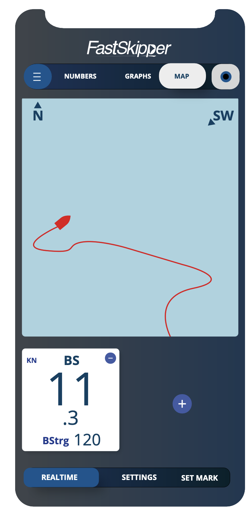

# FastSkipperTestTask
Это часть нашей уже реализованной программы FastSkipper.

## Задание:

Это часть нашей уже реализованной программы. 

От дизайна необходимо взять карту и два квадрата с данными. Выведите в них Heel и Pitch значения с гироскопа встроенного в айфон. 
На карте должен отображаться трек с айфона. Просто рисование линии по GPS необходимо. 

В качестве результата присылайте в ответ записанное видео экрана, на котором будет видно в действии как все работает и отдельно код.  

Мы оцениваем эту задачу как очень простую и нам поэтому будет интересно увидеть скорость исполнения. 

## Реализовано:

1 - Карта на базе **MapKit**. 
2 - Интерфейс для отображения перемещения пользователя. 
3 - Интерфейс для отображения данных *Pitch* и *Heel*. 
4 - *Запись пути* пользователя с сохранением координат с интервалом в 3 секунды. 
5 - Постоянное отображение *компаса* на карте. 

## Стэк технологий:

- UIKit (MVC) 
- MapKit 
- CoreLocation 
- CoreMotion 

Поддержка iOS 16 (так как необходимо было производить тесты на реальном устройстве, а в наличии был только с версией 16)
